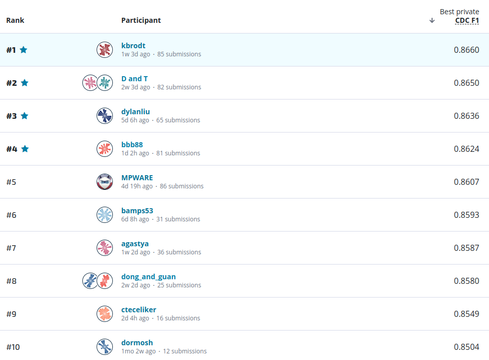
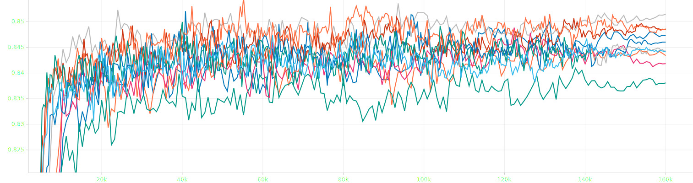

# Youth Mental Health Narratives: Automated Abstraction

[Youth Mental Health Narratives: Automated Abstraction](https://www.drivendata.org/competitions/295/cdc-automated-abstraction/)
Apply machine learning techniques to automate the process of data abstraction
from youth suicide narratives.

[1st place](https://www.drivendata.org/competitions/295/cdc-automated-abstraction/leaderboard/) out of 588
participants with 0.866 CDC F1 (top2 0.865, top3 0.8636).



Time spent: ~100 hours.

## Approach

We addressed a multilabel text classification problem for long documents using
[BigBird](https://github.com/google-research/bigbird) and [Longformer](https://github.com/allenai/longformer) models. Pretraining BigBird as a masked language model
with a 512 block size proved effective, while attempts to pretrain Longformer
led to NaN values. Fine-tuning employed the symmetric [Lovász](https://arxiv.org/abs/1705.08790) loss, with binary
cross-entropy and focal losses yielding comparable performance. We trained with
a learning rate of 1e-5, a linear scheduler with 2 warmup epochs, batch sizes
of 4 (BigBird) and 2 (Longformer) per GPU, and for 200 and 400 epochs,
respectively. Optimal thresholds were determined for each binary variable, and
a 5-fold ensemble improved generalization.

Typical learning curves of the model (CDC F1 on 5 folds)



## Highlights

- BigBird and Longformer models
- symmetric lovasz loss
- pretrain masked language model for BigBird (with 512 block size)
- mixed precision
- `1e-5` learning rate
- linear scheduler with 2 epochs of warmup
- batch size 4 per GPU for BigBird (with gradient checkpointing) and 2 for Longformer
- 200 epochs for BigBird and 400 for Longformer
- best threshold for each binary variable
- ensemble across 5 folds with `average` strategy (see [below](#average-strategy))

## Prerequisites & Hardware

- GNU/Linux 4.18.0-477.21.1.el8_8.x86_64
- [Python 3.10.12](https://www.python.org/) (GCC 11.4.0)
- Nvidia driver version: 535.216.01
- CUDA version: 12.2
- 2 x Nvidia Tesla V100-SXM2-32GB GPUs
- [PyTorch 2.5.1](https://pytorch.org/)
- Intel(R) Xeon(R) Gold 6148 CPU @ 2.40GHz
- 16 GB RAM
- `pip install -r requirements.txt`

## Setup & Inference

Download the data from the competition page and unzip into `data` folder. Then
download pretrained models from [yandex disk](https://yadi.sk/d/Wnx0NX1Z_J4qNA) (~14Gb).

Finally, run the script to produce the `submission.csv`

```bash
python main.py
```

The inference takes ~1 hour on 1 Nvidia GPU T4 16GB.

## Train

Run

```bash
sh ./run.sh
```

It takes ~10 days on 2 V100 GPUs (1 day for one model per each fold).

## Previous experiments

| model                                                      | public | private |
| ---                                                        | ---    | ---     |
| Tf-Idf+Logistic Regression with L1 loss                    | 0.7510 | 0.7417  |
| Tf-Idf+LightGBM                                            | 0.7487 | 0.7472  |
| Mistral-7B-Instruct-v0.3 with prompt engineering           | 0.7202 | 0.7203  |
| LightGBM on top of Mistral-7B-Instruct-v0.3 predictions    | 0.7803 | 0.7862  |
| longformer-base                                            | 0.8302 | 0.8276  |
| longformer-large                                           | 0.8375 | 0.8320  |
| 5 folds voting longformer-large                            | 0.8608 | 0.8592  |
| bigbird-roberta-base                                       | 0.8296 | 0.8257  |
| MLM bigbird-roberta-base                                   | 0.8402 | 0.8334  |
| MLM bigbird-roberta-large                                  | 0.8503 | 0.8464  |
| 5 folds voting MLM bigbird-roberta-large                   | 0.8599 | 0.8578  |
| 5 folds voting longformer-large+MLM bigbird-roberta-large  | 0.8608 | 0.8603  |
| 5 folds average longformer-large+MLM bigbird-roberta-large | 0.8706 | 0.8660  |

## Ensambling strategies

### `voting` strategy

```python
# predictions.shape == (n_models, N, C)
# threshes.shape == (n_models, C)

predictions = predictions > threshes[:, None]       # (n_models, N, C)
predictions = np.mean(predictions, axis=0).round()  # (N, C)
```

### `average` strategy

```python
threshes = np.mean(threshes, axis=0)        # (C, )
predictions = np.mean(predictions, axis=0)  # (N, C)
predictions = predictions > threshes        # (N, C)
```

For me, the `average` strategy was crucial to win the "lottery".
